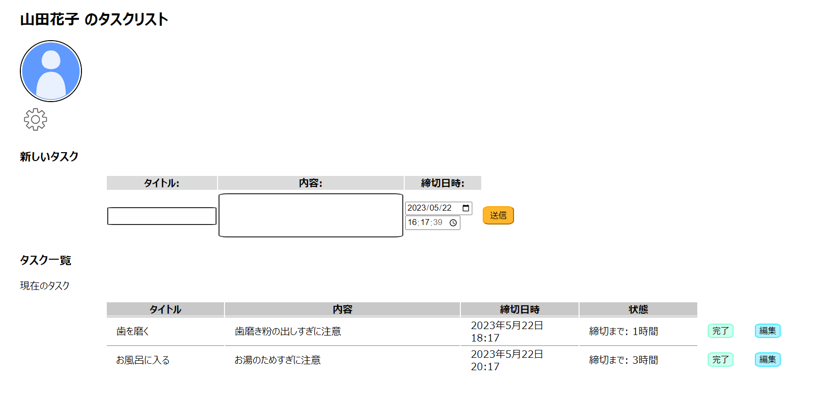

# taskapp
Django, HTML, SCSS, JavaScript で作ったタスクアプリ (制作中)

## Usage
1. 
    ```sh
    python3 -m venv .venv
    source .venv/bin/activate
    pip install -r requirements.txt
    ```
    により、仮想環境を作成して入り、必要なモジュールをインストールします。
2. ```sh
   python3 manage.py runserver
   ```
   で、仮想サーバーを立ち上げます。
3. [http://127.0.0.1:8000/tasks/](http://127.0.0.1:8000/tasks/) にアクセスし、アカウントを作成します。
4. 作成したアカウントでログインします。
5. タスク管理画面に入ります。


## Contents
- タスクの作成・編集・削除が可能です。
  - 編集および削除については、Ajax による非同期処理を行っています。

## To Do
- デザイン改善
    - 現在は、タスク管理画面の CSS を少し書いた程度です。
- ユーザーアイコン設定機能
    - 現在は、アイコンが設定されていればそのアイコンを、されていなければデフォルトユーザーアイコンが表示されるようになっています。
- 設定機能
    - 現在は、タスク管理画面に歯車マークしか作っていません…